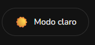
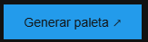
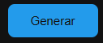
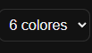
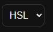
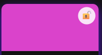
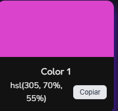
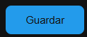
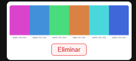
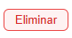

# Proyecto M1 FT76 - Colorfly Studio

Generador de paletas de colores interactivo. Proyecto del modulo 1 del bootcamp

## Tecnologias
- HTML semantico
- CSS3 (Flexbox, Grid, variables y colores HSL - HEX)

## Como usar
- Descargar la carpeta del proyecto  o ir al link de GitHub Pages
- Abrir el archivo index.html
- Seleciona entre modo oscuro o claro segun tu preferencia 
- Click en el boton generar paleta para ir a la seccion de generacion
- Con el boton generar  se genera una paleta aleatoria de colores
- Puedes elegir el tamaño de la paleta 
- Puedes cambiar el nombre del color de HSL a HEX y viceversa 
- Tambien puedes bloquear uno o varios colores para que no se cambien cuando generes una nueva paleta
- Puedes copiar el codigo del color dependiendo de tu selecion ya sea HLS o HEX
- Guarda tus paletas favoritas con el boton guardar 
- Para abrir tus paletas guardadas solo haz click en la imagen
- Para eliminarlas, haz click en eliminar 

## Link GitHub Pages
- https://nelson19926972-eng.github.io/Proyecto-M1-FT76---Nelson-Arzuza/

